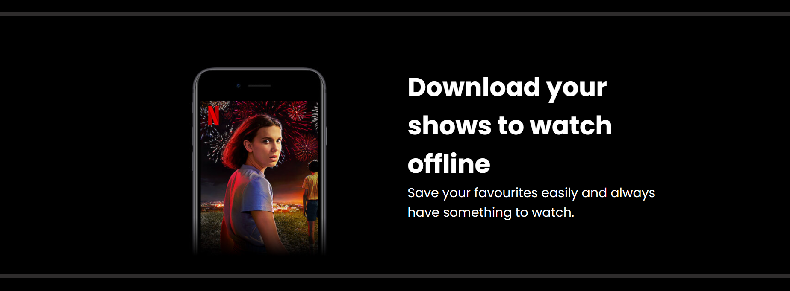
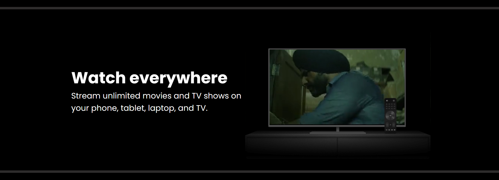
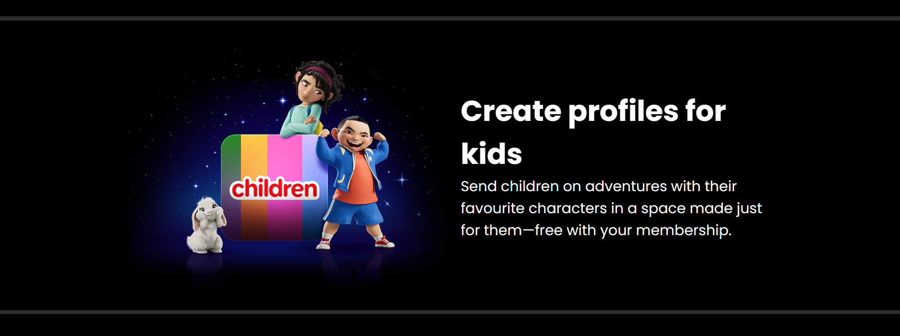
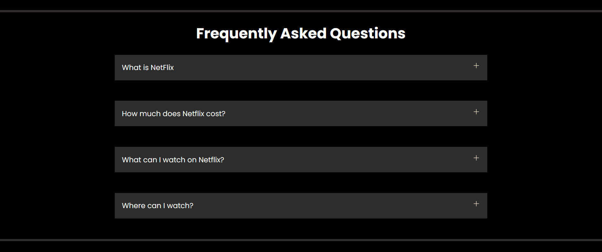

# 🎬 Netflix Clone


A visually appealing **Netflix landing page clone** built using **HTML, CSS, and JavaScript**.  
This project recreates the look and feel of Netflix’s homepage with a strong focus on **UI design**, **responsiveness**, and **clean code**.

> 🚀 Ideal for front-end practice, portfolio showcase, and UI/UX learning.

---


##  📸 Preview






---
## 🌟 Features

- 🎥 Netflix-inspired modern UI
- 🖼️ High-quality images and video assets
- 📱 Fully responsive design (mobile, tablet & desktop)
- 🎞️ Embedded background video
- ⚡ Smooth hover effects and transitions
- 🧩 Clean, readable, and well-structured code

---

## 🛠️ Tech Stack

- **HTML5** – Markup and structure  
- **CSS3** – Styling, layout, and responsiveness  
- **JavaScript** – Interactivity and dynamic behavior  

---

## 📁 Project Structure

```text
netflix-clone/
│
├── assets/
│   ├── images/
│   │   ├── background.jpg
│   │   ├── bg.jpg
│   │   └── logo.svg
│   └── videos/
│       └── video1.m4v
│
├── index.html
├── style.css
├── script.js
└── favicon.ico
```
---

## 🚀 Getting Started

Follow these steps to run the project locally:

1. **Clone the repository**

   ```bash
    git clone https://github.com/Rahulpande7795/netflix-clone.git
   ```
2.**Navigate to the project folder**
   ```bash
   cd netflix-clone
  ```
3.Open **index.html** in your browser
--- 

##🤝 Contributing

Contributions are welcome!

Feel free to fork the repository and submit a pull request.
---

